# Replicated Database with Write-Ahead Logging (WAL)
 
## Introduction
 
This project implements a sharded database system that ensures data consistency across replicated shards using a Write-Ahead Logging (WAL) mechanism. This approach helps maintain a consistent state in the event of unexpected shutdowns by logging changes before applying them to the database.
 
### Steps
 
1. Clone the repository:
   ```bash
   git clone https://github.com/your-repository-url
   ```
2. Navigate to the project directory:
   ```bash
   cd your-project-directory
   ```
3. Build the Docker image:
   ```bash
   docker build -t your-docker-image .
   ```
4. Run the Docker container:
   ```bash
   docker run -p 5000:5000 your-docker-image
   ```
 
## Usage
 
To start the system, execute the Docker container which will initiate the database and start the Flask application. The system is then ready to handle API requests to manage data entries.
 
## Features
 
- **Sharded Database**: Distributes data across several shards, enhancing performance and scalability.
- **Write-Ahead Logging**: Ensures data integrity by logging changes before they are committed to the database.
- **Replication**: Maintains copies of data across different servers to ensure high availability and fault tolerance.
- **Recovery**: Supports system recovery by restoring the database to a consistent state using the WAL files.
 
## Configuration
 
Configuration details such as database connection settings are managed in the Docker configuration files and environment variables.
 
## Documentation
 
Refer to the inline comments within the code for detailed explanations of the functionality and architecture. The project also includes system diagrams and a detailed explanation of the WAL mechanism.
 
## Examples
 
Here are some examples of API calls that can be made to the system:
 
- **Add Entry**:
  ```bash
  curl -X POST localhost:5000/add -d '{"shard":"sh1", "data":{"Stud_id":123, "Stud_name":"John Doe", "Stud_marks":88}}'
  ```
 
- **Update Entry**:
  ```bash
  curl -X PUT localhost:5000/update -d '{"shard":"sh2", "Stud_id":123, "data":{"Stud_marks":90}}'
  ```
 
- **Delete Entry**:
  ```bash
  curl -X DELETE localhost:5000/delete -d '{"shard":"sh3", "Stud_id":123}'
  ```

## Overview

This project demonstrates a scalable, sharded database system intended for educational purposes on distributed systems concepts. It features server implementation handling sharded data, a custom load balancer for request distribution, and analysis of system performance under various configurations.

## System Requirements

- **OS**: Ubuntu 20.04 LTS or above
- **Docker**: Version 20.10.23 or above
- **Python**: 3.6 or newer
- **MySQL**: Version 8.0

## Getting Started

### Setup

1. **Install Docker**  
   - Visit [Docker's official installation guide](https://docs.docker.com/engine/install/ubuntu/) and follow the instructions to install Docker on Ubuntu.

### Running the Application

1. **Build Docker Containers**
   ```
   # Without using docker-compose
   make run
   
   # With using docker-compose
   make run_compose
   ```
## Architecture

This scalable sharded database system is designed around the principles of distributed databases, specifically focusing on sharding and load balancing. 

- **Database Sharding**: Data is horizontally partitioned across multiple shards. Each shard holds a subset of the data, allowing for distributed queries and operations.
- **Load Balancer**: Implements consistent hashing to distribute read and write requests across shards efficiently, ensuring even load distribution and facilitating scalability.
- **Server Containers**: Each container simulates a database server managing a set of shards. Servers are orchestrated using Docker, enabling easy scaling and replication.

## Task Implementations

### Task 1: Server Implementation

Servers are designed to manage sharded data with the following endpoints:
- `/config`: Initializes shard configurations.
- `/heartbeat`: Provides server status.
- `/copy`, `/read`, `/write`, `/update`, `/del`: Handle data operations within shards.

### Task 2: Load Balancer Enhancement

The load balancer has been enhanced to support dynamic shard and server management, featuring endpoints for initializing configurations, adding/removing servers, and distributing read/write requests.

### Task 3: Performance Analysis

Performance analysis involved measuring read and write speeds under various configurations:
- **Default Configuration**: Demonstrated baseline performance.
- **Increased Shard Replicas**: Showed improved read speeds due to parallelism.
- **Increased Servers and Shards**: Highlighted scalability and its impact on performance.
- **Endpoint Correctness**: Validated through simulated server failures and automatic recovery.

### Tests

<p align="center">
      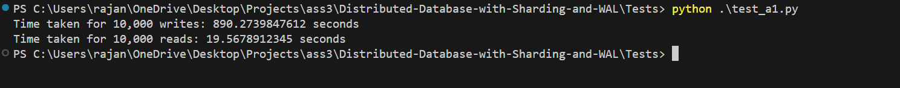<br><strong>Test-1 results for 10000 reads and 10000 writes</strong>
</p>

<p align="center">
      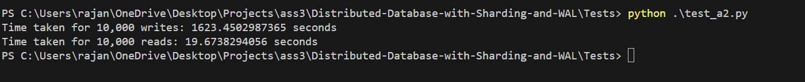<br><strong>Test-2 results for 10000 reads and 10000 writes (Write Speed-down = 2.14267270488, Read Speed-up = 1.08771929825)</strong>
</p>

<p align="center">
      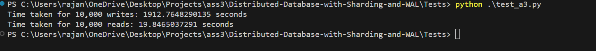<br><strong>Test-3 results for 10000 reads and 10000 writes (Write Speed-down = 2.5979025146, Read Speed-up = 1.0350877193)</strong>
</p>


## Endpoints test results

### Server

#### Endpoint (/config, method=POST)
<p align="center">
      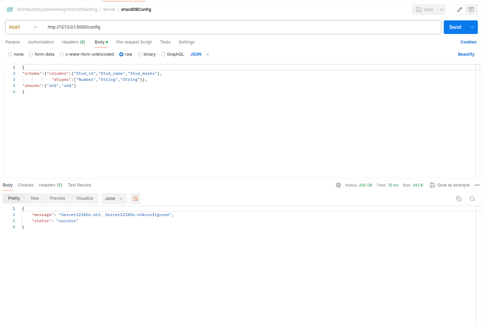<br><strong>Working of Server endpoint /config</strong>
</p>

#### Endpoint (/heartbeat, method=GET)
<p align="center">
      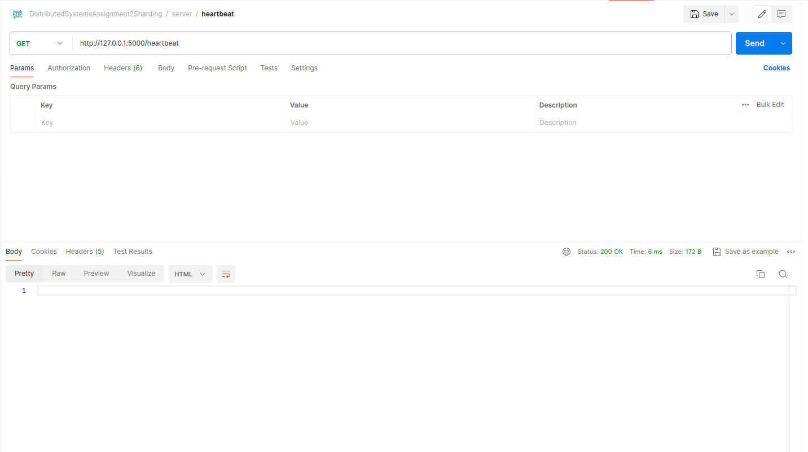<br><strong>Working of Server endpoint /heartbeat</strong>
</p>

#### Endpoint (/copy, method=GET)
<p align="center">
      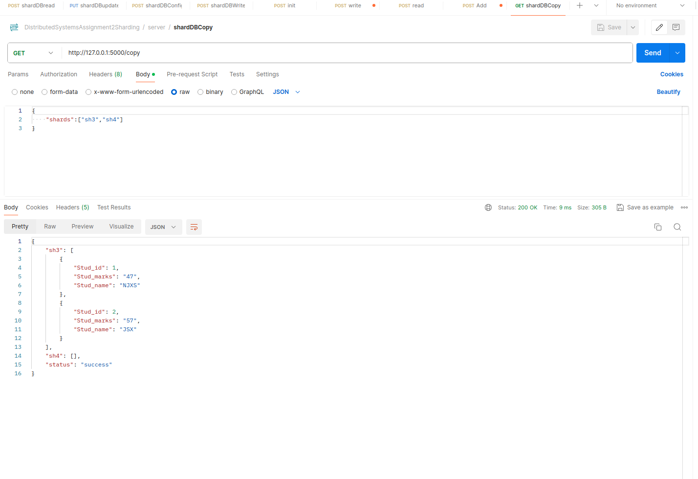<br><strong>Working of Server endpoint /copy</strong>
</p>

#### Endpoint (/read, method=POST)
<p align="center">
      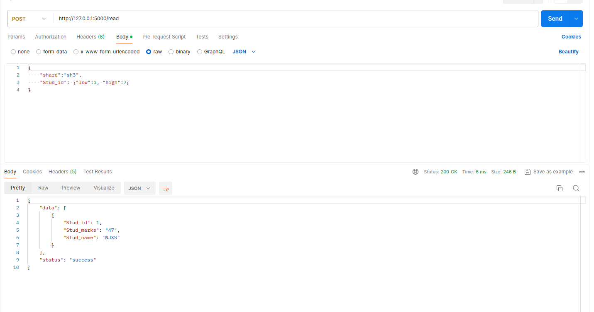<br><strong>Working of Server endpoint /read</strong>
</p>

#### Endpoint (/write, method=POST)
<p align="center">
      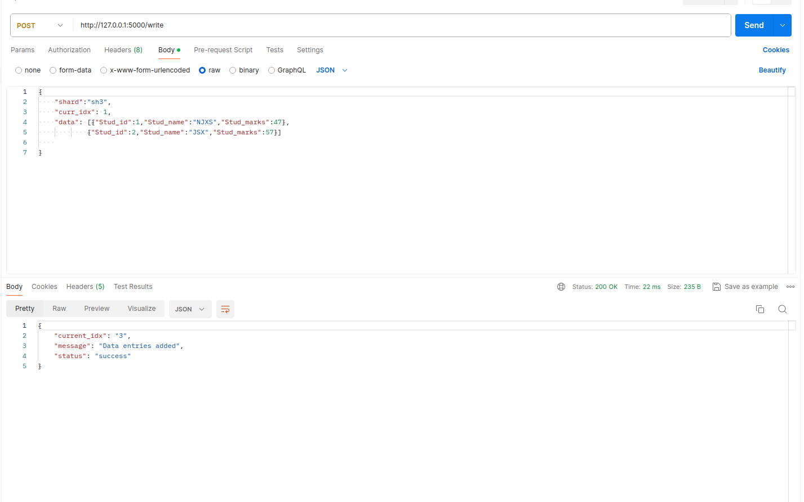<br><strong>Working of Server endpoint /write</strong>
</p>

#### Endpoint (/update, method=PUT)
<p align="center">
      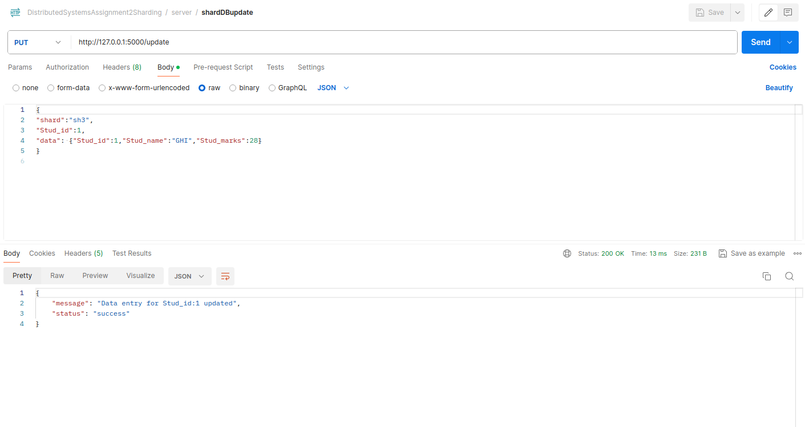<br><strong>Working of Server endpoint /update</strong>
</p>

#### Endpoint (/del, method=DELETE)
<p align="center">
      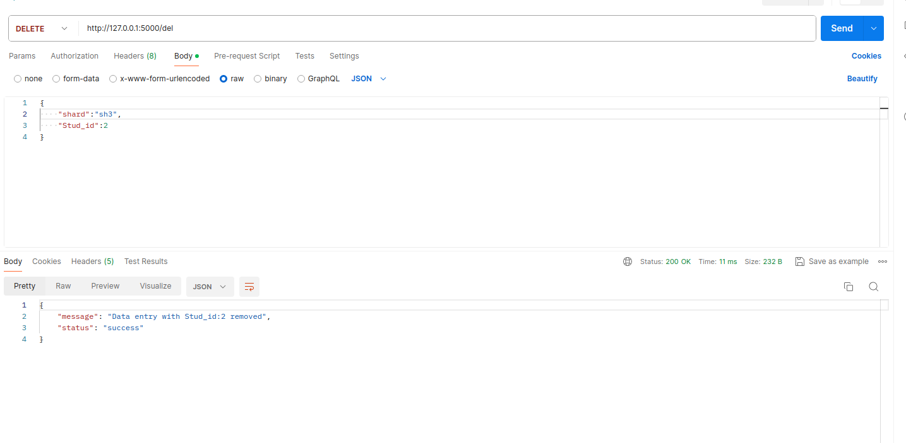<br><strong>Working of Server endpoint /del</strong>
</p>

### Load Balancer

#### Endpoint (/init, method=POST)
<p align="center">
      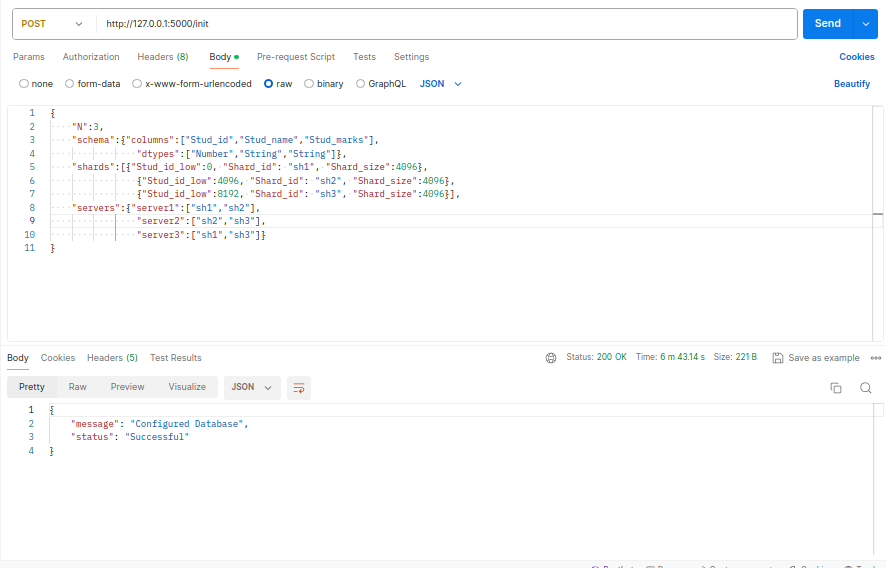<br><strong>Working of Load-balancer endpoint /init</strong>
</p>

#### Endpoint (/status, method=GET)
<p align="center">
      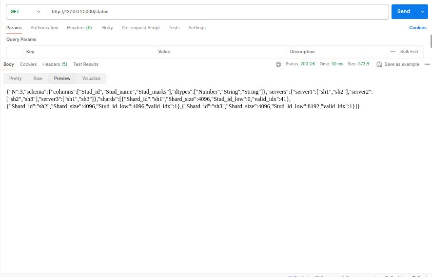<br><strong>Working of Load-balancer endpoint /status</strong>
</p>

#### Endpoint (/add, method=POST)
<p align="center">
      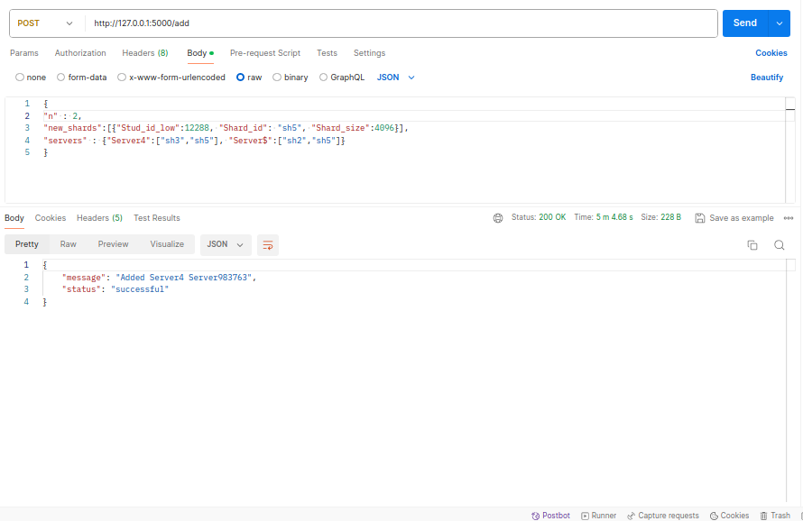<br><strong>Working of Load-balancer endpoint /add</strong>
</p>

#### Endpoint (/rm, method=DELETE)
<p align="center">
      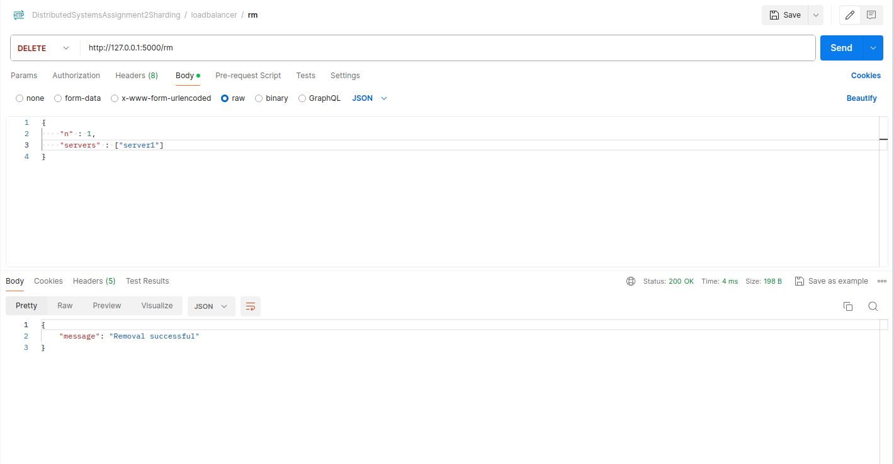<br><strong>Working of Load-balancer endpoint /rm</strong>
</p>

#### Endpoint (/read, method=POST)
<p align="center">
      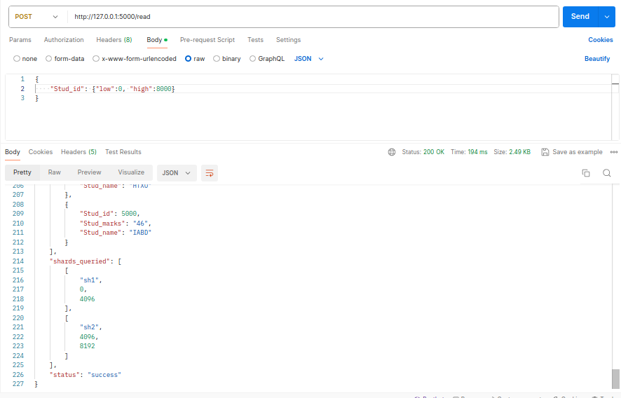<br><strong>Working of Load-balancer endpoint /read</strong>
</p>

#### Endpoint (/write, method=POST)
<p align="center">
      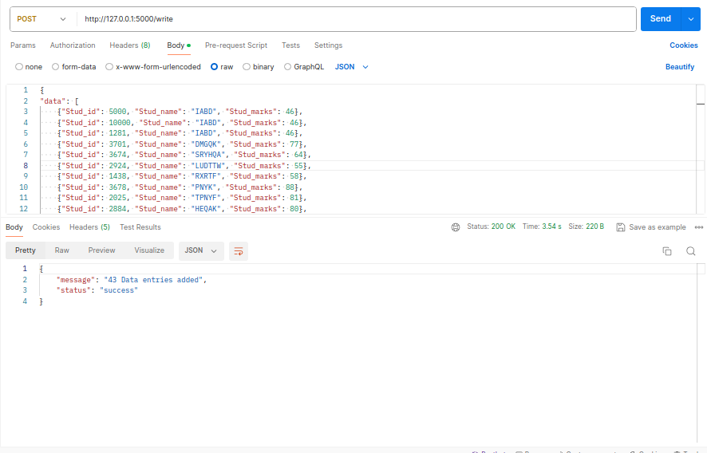<br><strong>Working of Load-balancer endpoint /write</strong>
</p>

#### Endpoint (/update, method=PUT)
<p align="center">
      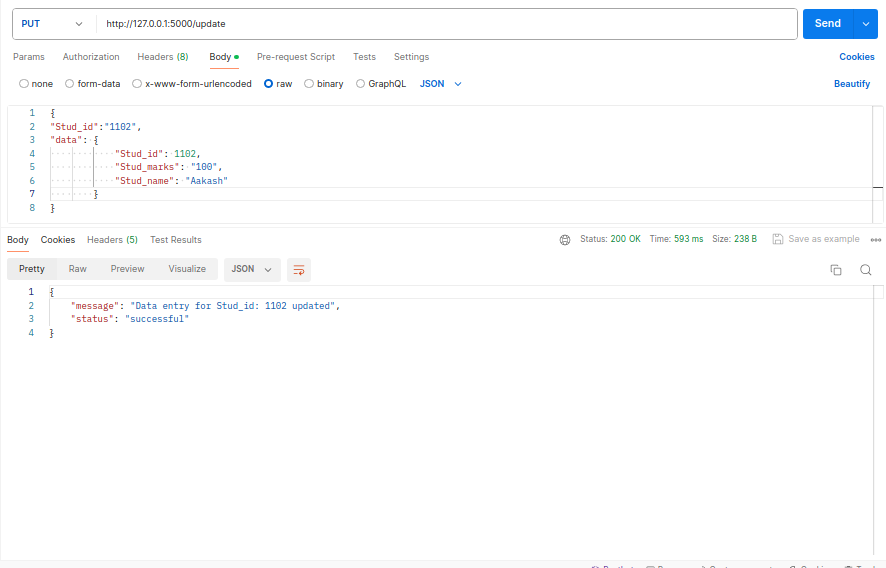<br><strong>Working of Load-balancer endpoint /update</strong>
</p>

#### Endpoint (/del, method=DELETE)
<p align="center">
      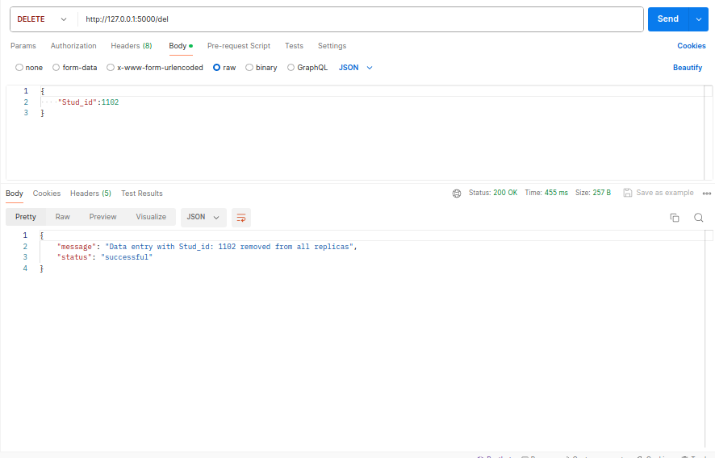<br><strong>Working of Load-balancer endpoint /del</strong>
</p>


#### heart_beat functionality 
<p align="center">
      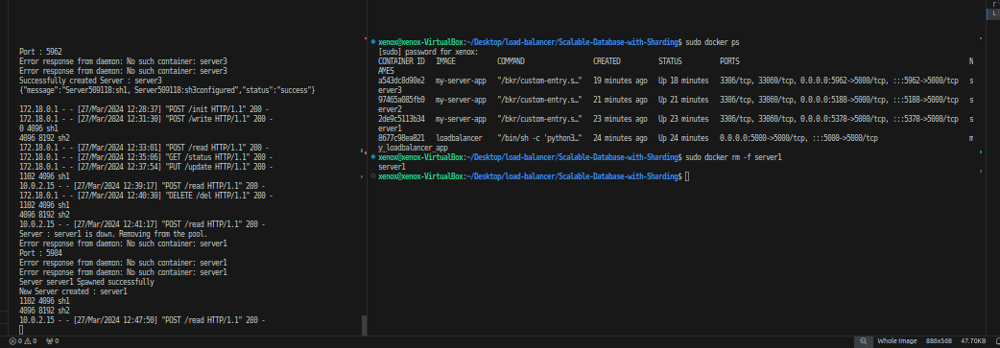<br><strong>Heart-beat working</strong>
</p>
<p align="center">
      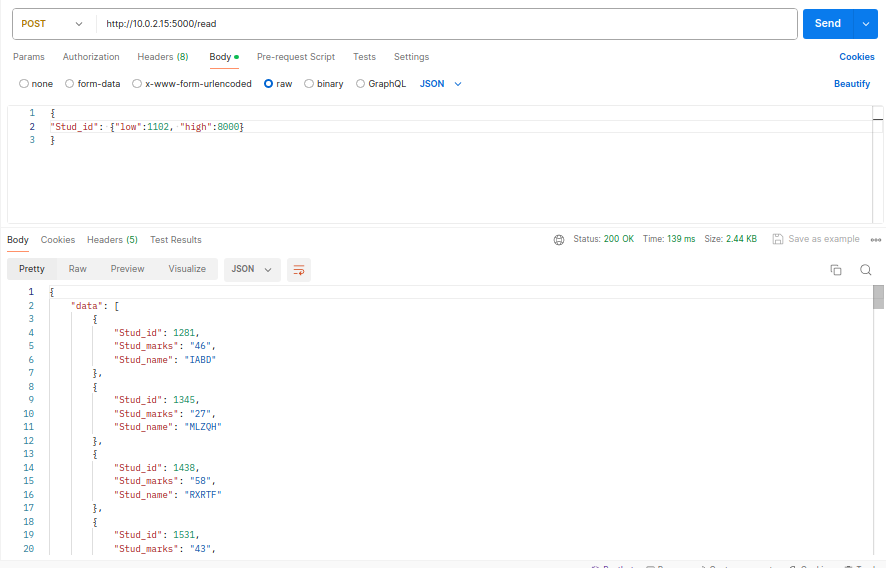<br><strong>Heart-beat working</strong>
</p>
## Appendix

### Docker and MySQL Setup

The project leverages Docker to run MySQL alongside the Flask application, facilitating an isolated and replicable environment. The `Dockerfile` sets up MySQL and installs necessary Python dependencies, while `deploy.sh` initializes the Flask application.

### References

- Docker Documentation: https://docs.docker.com/
- MySQL Official Guide: https://dev.mysql.com/doc/
- Python Virtual Environments: https://docs.python.org/3/tutorial/venv.html

## Contributors

- Aakash Gupta
- Rajanyo Paul
- Avik Pramanick
- Soham Banerjee
